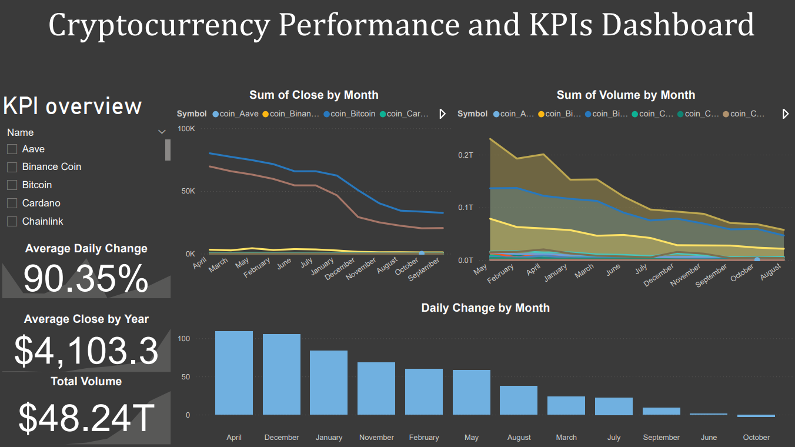

# Cryptocurrency Performance Dashboard 🚀

## Overview
An interactive Power BI dashboard that tracks and visualizes key performance indicators (KPIs) for major cryptocurrencies (Bitcoin, Ethereum, etc.) based on historical price data.

## Features
- Displays Average Close Price, Daily Change %, and Total Volume.
- Interactive filters by Month and Symbol.
- Visuals include:
  - Line Chart (Average Close by Month)
  - Clustered Column Chart (Daily Change %)
  - Line Chart (Volume over Time)
  - KPI Cards for quick insights

## How to Use
1. Download or clone the repository.   
2. Open the Power BI file to explore the dashboard.

## Preview

